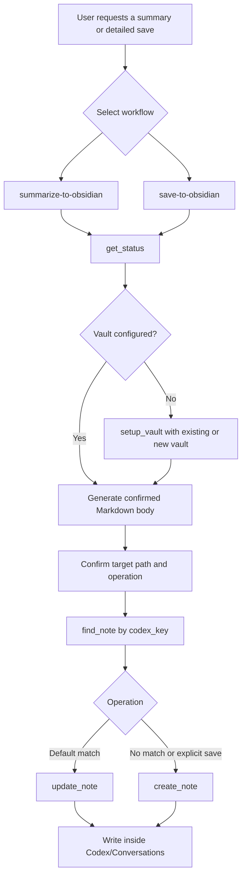

# Codex to Obsidian

Codex to Obsidian saves Codex conversation outputs as local Markdown notes in an Obsidian vault.
It exposes the `summarize-to-obsidian` and `save-to-obsidian` skills.
It writes notes only inside the configured `Codex/Conversations` folder.
It sends note content to the MCP server as one Markdown `body` field.
It does not sync notes to a cloud service.
It does not search the full vault, delete notes, or write outside the configured folder.
It does not automate the Obsidian user interface.
It does not export a verbatim transcript.



## Install From The Codex App

1. Open Codex.
2. Open Plugins.
3. Choose Add, then Add marketplace.
4. Enter `https://github.com/AnwarRezk/codex-to-obsidian`.
5. Install `codex-to-obsidian`.
6. Start a new task before testing the skills.

## Install From The CLI

For local development from a cloned repository, run these commands from the repository root:

```powershell
codex plugin marketplace add ./local-marketplace
codex plugin add codex-to-obsidian@local-codex
```

For the public GitHub marketplace, run:

```powershell
codex plugin marketplace add AnwarRezk/codex-to-obsidian --ref main --sparse local-marketplace
codex plugin add codex-to-obsidian@local-codex
```

The published marketplace package already includes `mcp-server/dist/standalone.js`.

## Requirements

You need a Codex build that supports plugins.
You need Node.js because `.mcp.json` starts the local MCP server with `node ./mcp-server/dist/standalone.js`.
You need a writable local Obsidian vault.

For local development from this repository, install dependencies and build the server from the plugin root:

```powershell
cd mcp-server
npm install
npm run build
```

## First-Run Setup

On first use, the MCP server returns `setup_required` when no saved configuration exists.
At that point, the skill asks for an existing absolute vault path or offers to create a new vault.

If you already have a vault, provide its absolute folder path.
`setup_vault` saves that path in the platform-specific config file and keeps `Codex/Conversations` as the default subfolder.

If you want a new vault, say to create one or omit the path.
`setup_vault` then creates `Documents/Codex Obsidian` under your home directory.
It also creates the `.obsidian` marker folder and the `Codex/Conversations` subfolder.

After setup returns `configured`, later saves reuse the persisted configuration.
The skills do not ask for the vault again unless the saved configuration is missing or invalid.

## Usage Examples

Use `summarize-to-obsidian` when you want a structured summary.

- `Summarize this conversation to Obsidian.`
- `Summarize this discussion to Obsidian and keep the important decisions.`

Use `save-to-obsidian` when you want a fuller technical handoff.

- `Save this conversation to Obsidian.`
- `Save this discussion to Obsidian with the commands, failures, and resolutions.`

An explicit `save` always creates a new note.
An explicit `update` updates the matching note after confirmation.
Without an explicit operation, the skills update when a matching note exists and create a note otherwise.

## Platform Configuration

The plugin stores its configuration in `config.json` inside the per-user configuration directory.

- Windows: `%APPDATA%\codex-to-obsidian\config.json`
- macOS: `~/Library/Application Support/codex-to-obsidian/config.json`
- Linux: `$XDG_CONFIG_HOME/codex-to-obsidian/config.json`
- Linux fallback when `XDG_CONFIG_HOME` is unset: `~/.config/codex-to-obsidian/config.json`

The config file stores `vaultRoot` and `relativeSubfolder`.
`relativeSubfolder` defaults to `Codex/Conversations`.

Example:

```json
{
  "vaultRoot": "C:/Notes/Obsidian",
  "relativeSubfolder": "Codex/Conversations"
}
```

For disposable local testing, set `CODEX_OBSIDIAN_VAULT` to an absolute vault root.
When that variable is set, the server uses it as the vault root and still loads `relativeSubfolder` from config when possible.

## Permissions And Full Access

If setup or a note write returns `permission denied`, stop retrying.
Rerun the task with Full Access or approve the configured vault path.
Keep the configured vault writable by the local MCP process.
Note paths must stay inside the configured `Codex/Conversations` folder.
Absolute paths, traversal segments, and null bytes are rejected.

## Troubleshooting

- If Codex cannot start the MCP server, install Node.js and make sure `mcp-server/dist/standalone.js` exists.
- If you cloned the repository for local development, rerun `npm install` and `npm run build` in `mcp-server`.
- If setup still shows `setup_required`, finish the vault prompt and confirm the chosen path.
- If config loading fails, check that `vaultRoot` is an absolute path and that the JSON is valid.
- If note creation fails because a file already exists, use an update flow or choose a different title.
- If `open_note` is used, remember that it returns a validated `obsidian://` URI and does not confirm that Obsidian opened.

## Development And Validation Commands

Run these commands from the plugin root during development:

```powershell
cd mcp-server
npm test
npm run build
cd ..
git diff --check
```

## Privacy And Disclaimer

This plugin is local-only in its current form.
It does not add telemetry or remote storage.
It writes only to the configured local vault path.
Codex to Obsidian is an independent project and is not affiliated with OpenAI or Obsidian.
